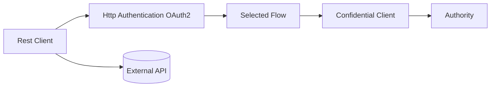
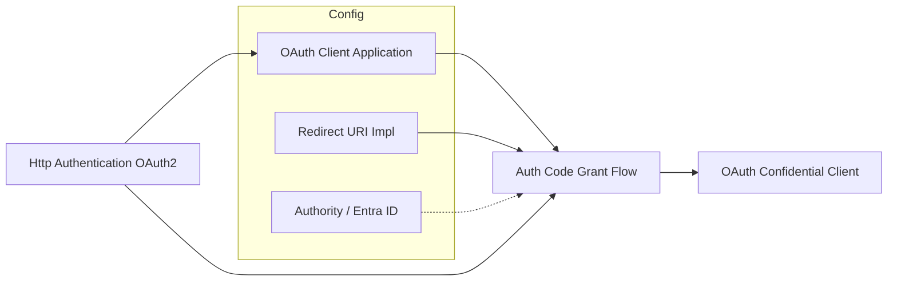
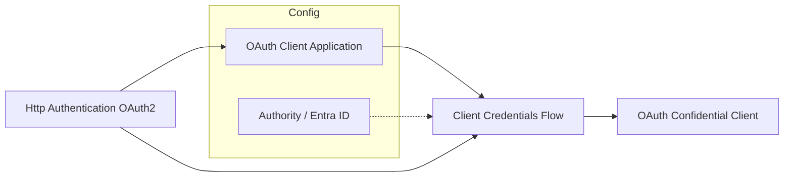
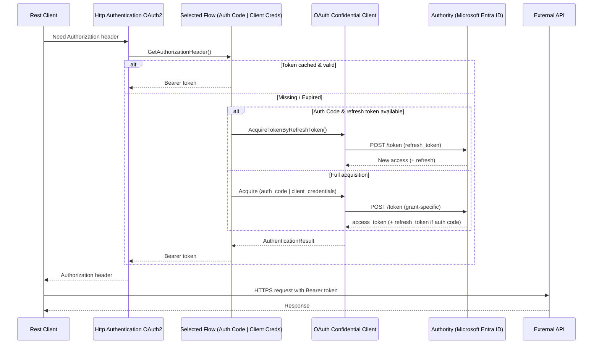
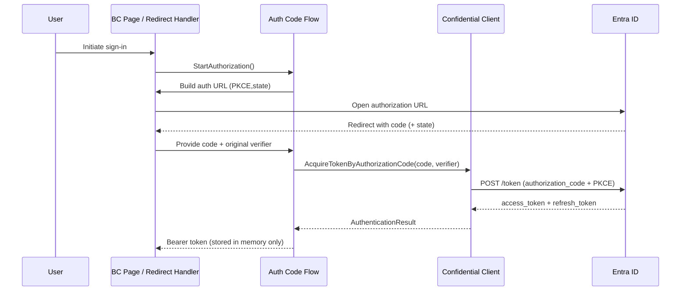
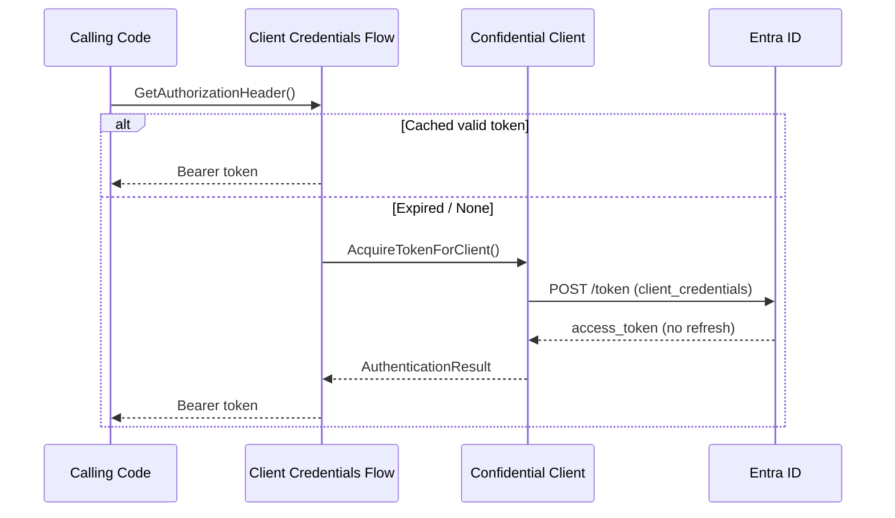
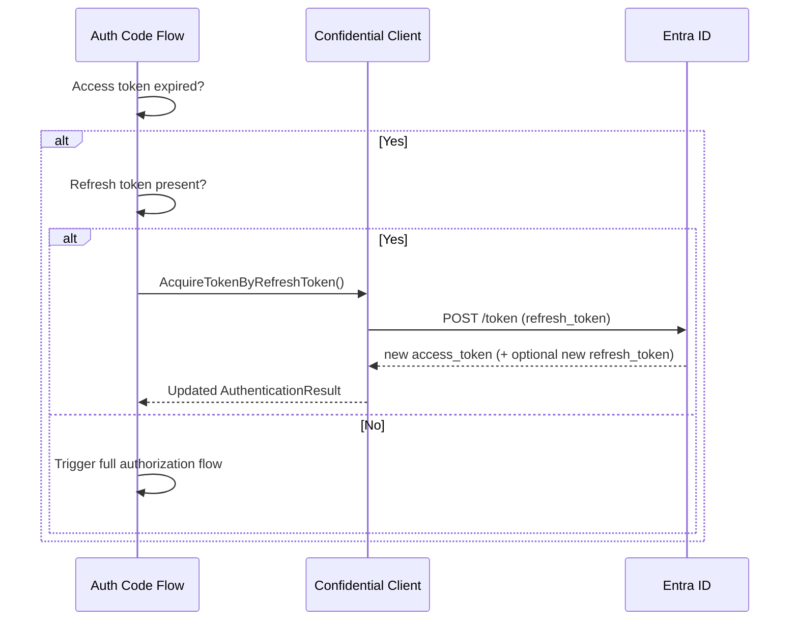

## Architecture

High-level overview of how the module composes OAuth 2.0 functionality for outbound REST calls in Business Central.

### Component Summary
- OAuth Client Application: Stores client id, secret or certificate, redirect URI type, scopes.
- OAuth Confidential Client: Performs token / refresh HTTP requests (with secret or signed client assertion).
- Authorization Flows: Authorization Code Grant and Client Credentials orchestrate token lifecycle.
- Redirect URI Implementations: Built‑in page redirect or custom control add-in.
- Authority (e.g. Microsoft Entra ID): Supplies discovery metadata (authorization, token endpoints).
- Http Authentication OAuth2: Facade consumed by the Rest Client; delegates to chosen flow to obtain bearer header.
- Rest Client: Issues outbound HTTP calls injecting the Authorization header provided by Http Authentication OAuth2.

---
### Component Diagrams

#### Part 1: Injection into Rest Client & Outbound Call Path
A minimalist structural view focused on how the Rest Client obtains an Authorization header and calls the external API.

Notes:
- Configuration objects and redirect handling are omitted here (details follow in Parts 1a/1b).
- Only one concrete flow instance backs `Selected Flow` at runtime (Auth Code or Client Credentials).
- Confidential Client is the only component performing HTTP token/refresh requests to the Authority.
- Rest Client proceeds to call the external API after `HA` returns a bearer token.

#### Part 1a: Detail – Composition (Authorization Code Grant Flow)

#### Part 1b: Detail – Composition (Client Credentials Flow)

Notes (for 1a/1b details):
- Dotted links from Authority indicate metadata (token endpoints) used by the flow; only the Confidential Client performs HTTP requests later to the authority endpoints.
- Redirect URI implementation (built-in or custom control add-in) is only part of Authorization Code flow.
- Confidential Client manages token and refresh exchanges for both flows.

#### Part 2: Runtime Usage & Token Retrieval
Illustrates how a REST call triggers token retrieval or refresh.

Notes:
- Only the Confidential Client sends HTTP calls to the Authority.
- Authorization Code flow prefers refresh over initiating a new browser/device interaction.
- Client Credentials flow never has a refresh token; it reacquires a new token on expiry.

---
### Sequence: Authorization Code Grant (High-Level)

### Sequence: Client Credentials Flow

### Sequence: Refresh (Authorization Code Flow)

### Advanced Redirect URI
The advanced redirect implementation uses a control add-in to encapsulate browser interaction and can enable an SSO-like experience (reuse existing session, possibly suppressing interactive prompts). See [Advanced Redirect URI](AdvancedRedirectURI.md).

---
### Key Design Choices
- In-memory token storage: tokens tied to object lifetime; no persistent cache.
- PKCE + state enforced for Authorization Code flow for prevent CSRF attacks.
- Scope offline_access auto-added for Authorization Code flow to enable refresh token issuance.
- Certificate support allows JWT client assertions (reduces secret distribution) in both flows.

### Extensibility Notes
- Additional authorities can implement the authority interface to supply endpoints and additional properties.
- New flows could plug in provided they delegate final token exchange to the Confidential Client.

For implementation details see: `Flows.md`, `Extensibility.md`, and `SecurityConsiderations.md`.
